## 要解決問題
事情是這樣子的，最近因為剛好有一些空閒時間，於是想要在原本部署在 Google App Enginee 的部落格進行排版的調整，並實做一些小功能，然而卻發現以前的開發，部署流程有些繁瑣，剛好工作上有接觸到 CI/CD 的概念，因此想說不如就趁此機會把也把 CI/CD 的實作應用到專案上，最終決定以 CircleCI 作為 CI/CD 工具以簡化之後的開發流程，並且順手記錄下來，想像上只要是部署在 GCP 上面的服務應該都通用 XD

<br>

### 導入前的開發部署流程
在開始之前我們先來看看導入前後的部署流程會是長怎樣XD
過去的開發流程如下
1. 本地開發測試
2. 將本地端變更的 Code 推上 Github Repository
3. 將本地端變更的 Code 推上 GCP

<br>

### 導入後的開發部署流程
整併 CircleCI 後的流程
1. 本地開發測試
2. 將變更的 Code 推上 Github, Github 自動去 trigger CircleCI 執行後續測試 & 部署上 GCP 的工作

<br>

### 一些隱藏的優點
雖然看起來只省了一個步驟好像沒有帶來多少好處，但事實上還有一些隱藏的優點會在未來慢慢體現，以下為一些隱藏好處的例子:
1. 導入 CI/CD 前可能測試好但是忘記部署，這時過了一段時間後想要到網站上面玩玩新的功能，卻發現找不到該功能，這時就要自己去 GCP 上面追部署的 Log, 看是哪一次忘記推上去 QAQ, 而這種情況若導入 CI/CD 後就可以確保，push 上 repository 跟 deploy 兩步驟被一起執行 ~
2. 假設 deploy 以及 test 會花很長的時間，在導入 CI/CD 後你可以把修改過的 code push 上 repository，然後安心的去做其他事情，靜待 CI/CD 的結果即可，這邊要推薦一下 CircleCI 會把結果直接送到你的 mail 中，方便大推 ~
3. 多一個地方可以看到過去每次 test 以及 deploy 的紀錄

<br>

## 開發環境
- Circleci
- Google App Engine

## 實作細節

### CircleCI 基本設定

1. 首先到 [CircleCI](https://circleci.com/signup/) 綁定 github 
    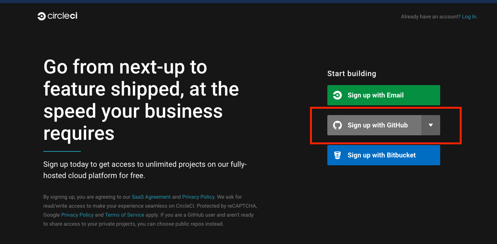

2. 綁定後使用選擇 Projects → 對應專案按下 Set Up Project
    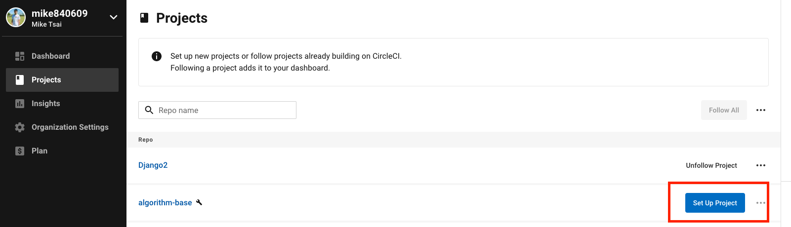

3. 接著選擇 Write your own using our starter config.yml template
    

4. 按下按鈕後會自動幫你生成 default 的 config.yml 檔案, 點擊右上方的 Commit and Run 
    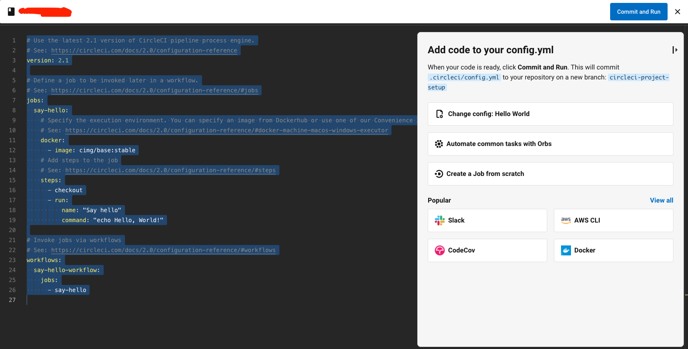
    
5. 這時如果你回到對應的 Github repository 查看你會發現 除了原本的 branch 外，會多出一個 branch `circleci-project-setup`
    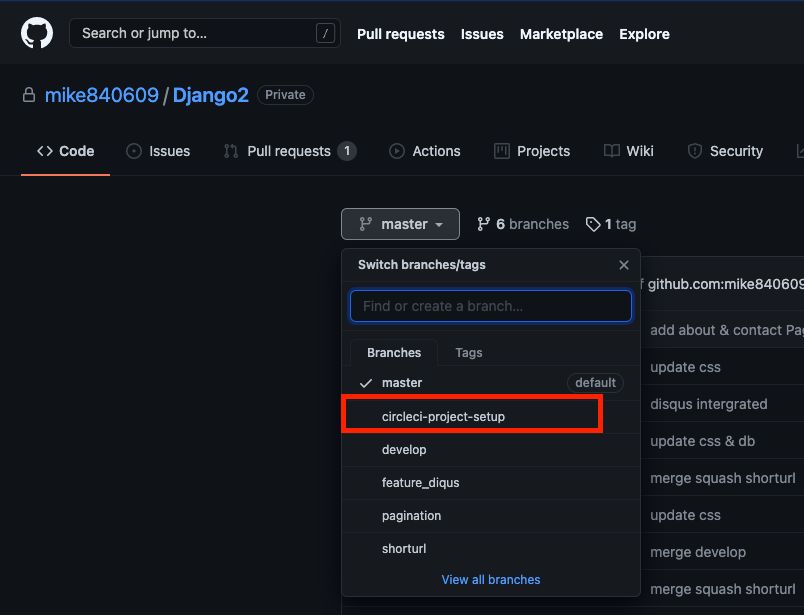
    
6. 而也可以從  CircleCi 的 dashboard 上面看到剛剛成功的執行結果
    
    
7. 點擊 say-hello 可以看到剛剛對應生成 config.yml 所定義的步驟
    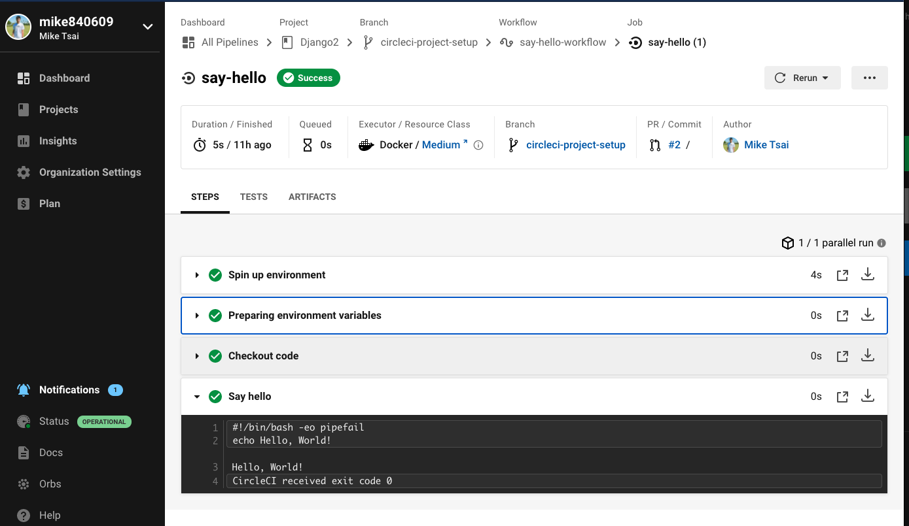

如果到這裡都沒有問題，恭喜你，已經順利將 Github repository 綁上 CircleCI  了~

<br/>

### Google App Engine deployment 設定
接著我們需要在 Google App Engine 進行一些設定

設定 CircleCI 環境變數
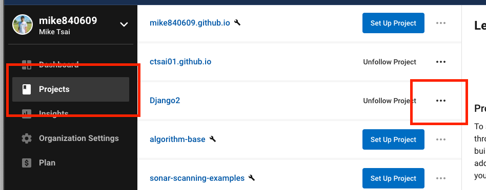

點擊 `project setting`
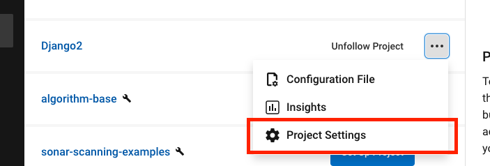

而後點擊 `Add Environment Variable`，先停在這頁, 我們先去 GCP 取得這三個變數 XD
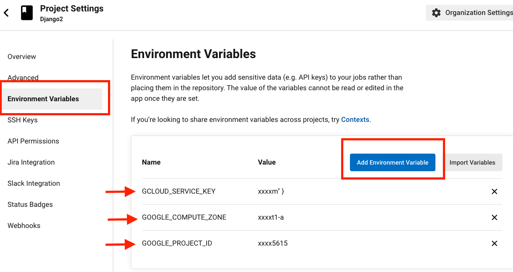

到 GCP 的 IAM 中，點擊 `服務帳戶`，點擊動作裡的三點圖標，點擊`管理金鑰`
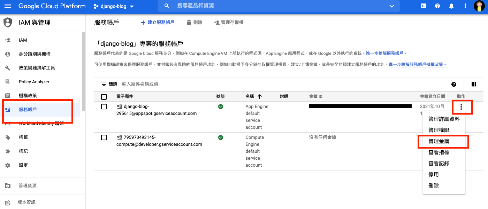

點擊建立新的金鑰，並選取 `JSON` 格式
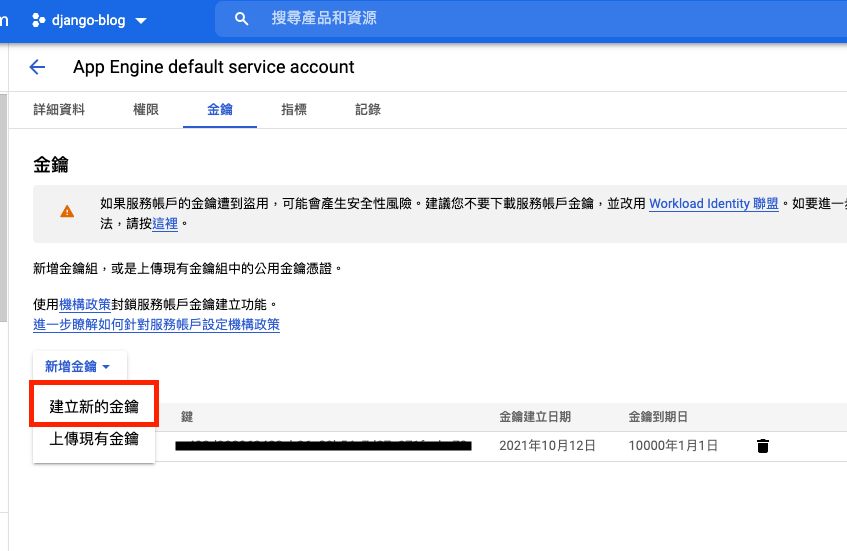

這時會到剛剛 CircleCI 環境變數的那頁

並且設定以下三個變數 
- `GCLOUD_SERVICE_KEY` (必要)
- `GOOGLE_COMPUTE_ZONE` (可選擇)
- `GOOGLE_PROJECT_ID` (可選擇)

GCLOUD_SERVICE_KEY 的值為剛剛我們下載 `JSON` 裡面所有的值，請直接將整個 `JSON` 的內容複製貼上~

最後到 GCP 中啟用服務 `APP Engine Admin API`
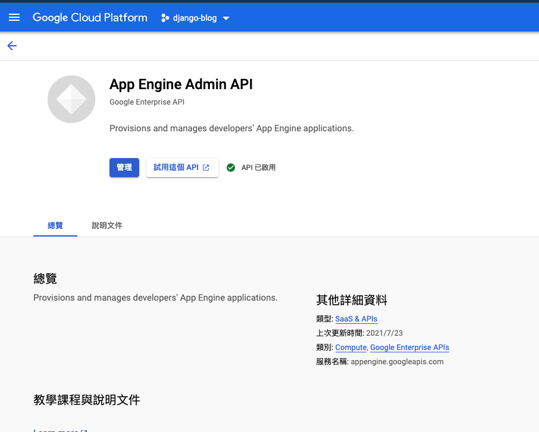

### 在專案中新增對應設定檔

接著到專案的根目錄中去添加 CircleCI 的設定檔案 `config.yml` <br/>
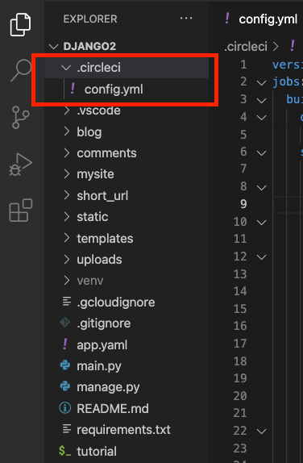

```
version: 2.1
jobs:
  build_and_deploy:     
    docker:
        - image: google/cloud-sdk:slim
    steps:
      - checkout
      - run:
          name: Install Env
          command: |
            apt install -y python-pip && \
            python3 -m pip install -r requirements.txt
      - run: 
          name: Deploy to Google Engine
          command: |
            echo ${GOOGLE_PROJECT_ID}
            echo ${GOOGLE_COMPUTE_ZONE}
            echo ${GCLOUD_SERVICE_KEY} > /tmp/sa_key.json
            gcloud auth activate-service-account --key-file=/tmp/sa_key.json
            rm /tmp/sa_key.json
            gcloud --quiet config set project ${GOOGLE_PROJECT_ID}
            gcloud --quiet config set compute/zone ${GOOGLE_COMPUTE_ZONE}
            gcloud --quiet app deploy
            
workflows:
  version: 2
  build_and_deploy:
    jobs:
      - build_and_deploy:
        filters:
          branches:
            only:
              - master    
```
簡單看一下 `script` 裡面做了什麼事情, 首先我們選用 `google/cloud-sdk:slim` docker image 作為 CircleCI 的運行環境(slim 版本的比較輕量), 然後定義了一個 job `build_and_deploy`, Job 內有兩件事情要做 `Install Env` & `Deploy to Google Engine`, 分別進行安裝環境以及部署上雲端，這邊會看到會去拉剛剛我們設定的環境變數 `GCLOUD_SERVICE_KEY`, 最後部署到 Google App Engine.

檢查 CICD 是否正常運行
```
$ git checkout -b "circleci-project-setup"
$ git add .
$ git commit -m "test"
$ git push origin circleci-project-setup
```
到 Github 中發 Pull Reuqest 到 master branch

此時應該會看到以下畫面
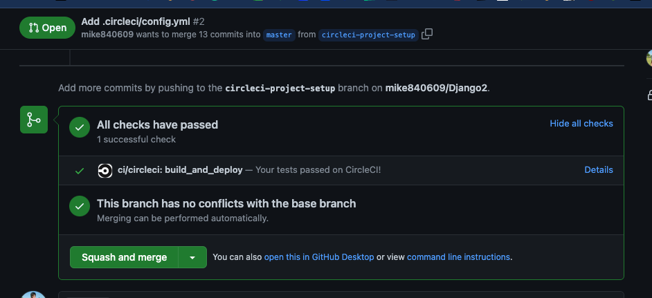

這時可以回到 CircleCI 利用對應的 Commit 編號去看對應的 Log
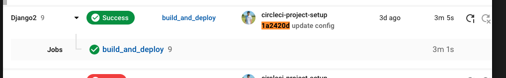

對應執行的指令
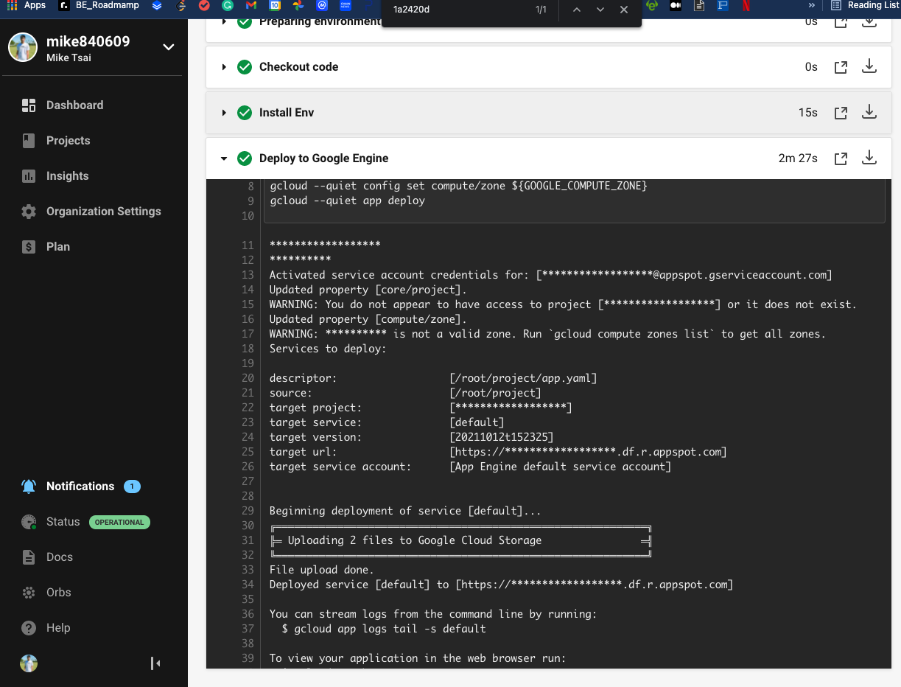

這時再回到 GCP 上面就可以看到成功部署拉～
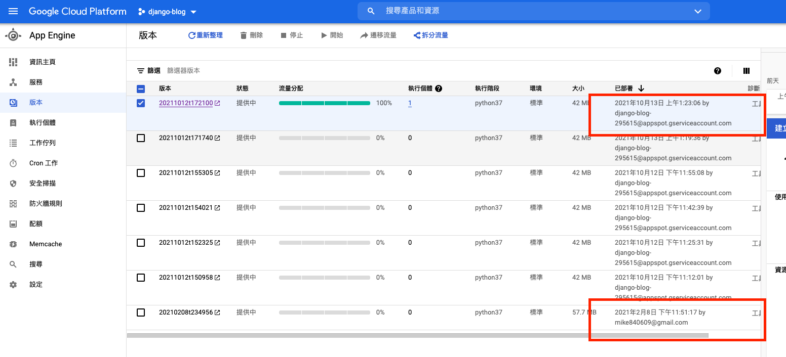

## 部署優化 (optional)
剛剛我們已經成功地將網站透過 CircleCI 部署上 GCP 了, 但是有沒有地方可以做得更好呢？
其實是有的，我們在建立CircleCI 環境時會利用 virtual environment 去建立環境，而這步驟其實是可以快取的，只要在每次運行前先 `restore_cache` 並在運行結束 `save_cache` 就可以達到快取的功能, 完整的代碼如下。

完整的 `.circle/config.yml`
```
version: 2.1
jobs:
  build_and_deploy:     
    docker:
        - image: google/cloud-sdk:slim
    steps:
      - checkout
      - restore_cache: # **restores saved dependency cache if the Branch key template or requirements.txt files have not changed since the previous run**
          key: deps1-{{ .Branch }}-{{ checksum "requirements.txt" }}
      - run:
          name: Install Env
          command: |
            apt-get install -y python3-venv
            python3 -m venv venv
            . venv/bin/activate
            pip install -r requirements.txt

          # command: |
          #   apt install -y python-pip && \
          #   python3 -m pip install -r requirements.txt

      - run: 
          name: Run Test Cases
          command: "echo dummy test case : Hello, World!"
      
      - save_cache: # ** special step to save dependency cache **
          key: deps1-{{ .Branch }}-{{ checksum "requirements.txt" }}
          paths:
            - "venv"
      - run: 
          name: Deploy to Google Engine
          command: |
            echo ${GCLOUD_SERVICE_KEY} > /tmp/sa_key.json
            gcloud auth activate-service-account --key-file=/tmp/sa_key.json
            rm /tmp/sa_key.json
            gcloud --quiet config set project ${GOOGLE_PROJECT_ID}
            gcloud --quiet config set compute/zone ${GOOGLE_COMPUTE_ZONE}
            gcloud --quiet app deploy
            
workflows:
  version: 2
  build_and_deploy:
    jobs:
      - build_and_deploy:
        filters:
          branches:
            only:
              - master
```


比較一下差異

快取前
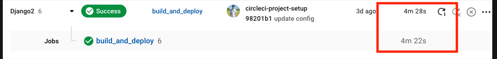
快取後
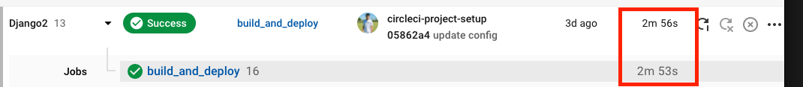


## 結論
感謝您的收看，今天我們嘗試了
1. 整合 CircleCI CI/CD
2. 自動部署上 Google App Engine
3. 利用快取優化部署時間

## 參考連結
- https://circleci.com/docs/
- https://hub.docker.com/r/google/cloud-sdk/
- https://ithelp.ithome.com.tw/articles/10230182